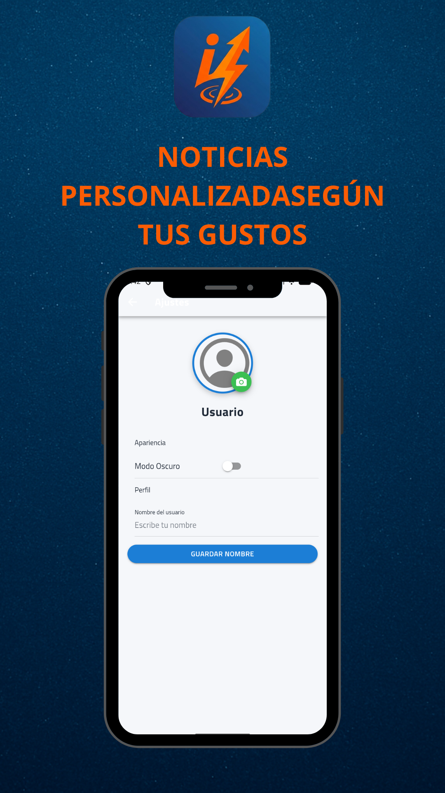

# 📱 InfoNow - Tu radar de noticias al instante

## 🌟 Vive la información, no solo la leas
**InfoNow** es la plataforma definitiva para estar al día de lo que ocurre a tu alrededor. Diseñada bajo un entorno moderno con **Ionic y Angular**, esta aplicación combina rapidez, geolocalización y multimedia para ofrecer una experiencia informativa única.

### ✨ Funcionalidades Estrella
* 📍 **Noticias Geolocalizadas:** Reporta y visualiza sucesos con tu ubicación GPS exacta gracias al uso de mapas nativos.
* 📸 **Reportero Ciudadano:** Captura y adjunta fotografías reales a tus noticias directamente desde la cámara de tu dispositivo.
* ⚡ **Alertas de Última Hora:** Interfaz dinámica que destaca visualmente las noticias urgentes.
* 🔗 **Conectividad Total:** Comparte cualquier noticia de forma nativa a través de tus redes sociales o apps de mensajería.
* 📳 **Experiencia Háptica:** Feedback visual y táctil para una navegación más inmersiva.

---

## 📸 Capturas de Pantalla (Mockups Pro)
Aquí puedes ver la interfaz de la aplicación diseñada para facilitar la lectura y la interacción:

| Pantalla Principal | Detalle de Noticia | Configuración |
| :---: | :---: | :---: |
|  |  |

---

## 🛠️ Especificaciones Técnicas (Release)
Este repositorio contiene la versión final lista para su distribución:

* **Package ID:** `com.jimenez.infonow`
* **Versión Semántica:** `1.0.0`
* **Formato de Entrega:** Android App Bundle (`.aab`) firmado digitalmente.
* **Tecnologías:** Ionic Framework, Angular, Capacitor, MockAPI para persistencia de datos.

---

## 📂 Estructura de Lanzamiento
En la carpeta `docs/store` encontrarás los activos necesarios para la publicación en Google Play Store:
* **Ficha Técnica (ASO):** Descripción optimizada y palabras clave.
* **Identidad Visual:** Iconos adaptativos y Banner de funciones (1024x500).
* **Política de Privacidad:** Documentación legal.

---

## ⚖️ Privacidad y Seguridad
InfoNow cumple con los estándares de seguridad requeridos. La **Keystore** de firma se ha gestionado de forma externa para garantizar la integridad del código fuente.
